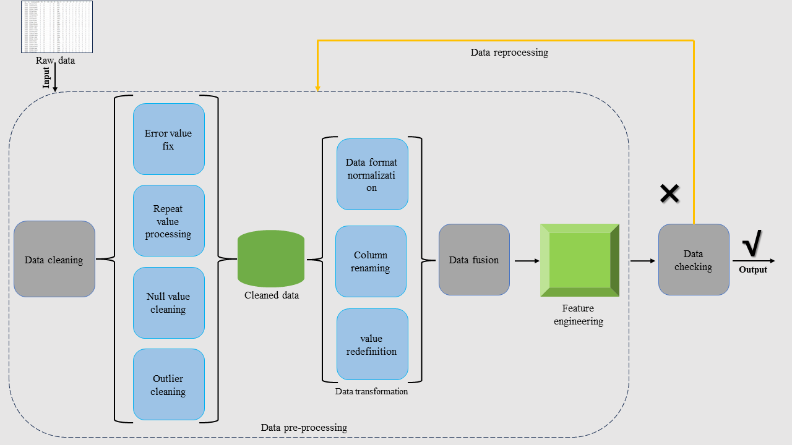
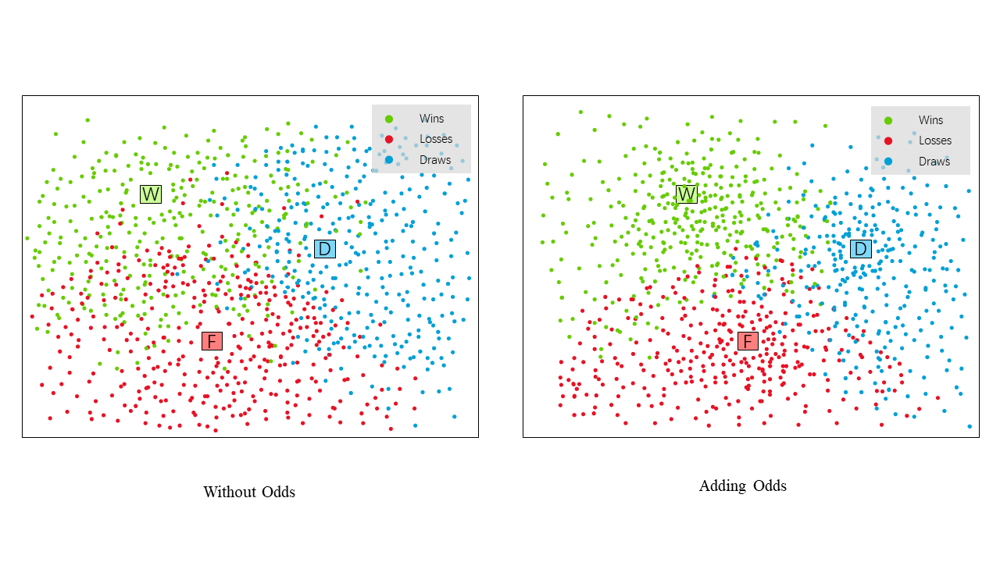
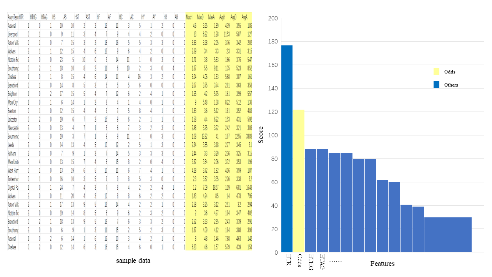

<br />
<p align="center">
  <h1 align="center">Exploiting the Potential of Odds Information on Football Match Prediction</h1>
  <p align="center">
    <br />
    <strong>Zhiyang Xiong</strong></a>
    ·
    <strong>Xianwei Geng</strong></a>
    ·
    <strong>Yuchen Lin</strong></a>
    ·
    <strong>Hucheng Wang</strong></a>
    <br />
    ·
    <strong>Huangtao Chen</strong></a>
    ·
    <strong>Lixiaoyuan Gao</strong></a>
    ·
    <strong>Chunlei Wang</strong></a>
    ·
    <strong>Tao</strong></a>
    <br />
  </p>

## Highlight!!!!

Exploiting the Potential of Odds Information on Football Match Prediction

## Abstract

Soccer is a hot sports activity around the world, the results of which touch the hearts of millions of fans and drive the sports betting industry to flourish. Based on this situation, the data of soccer matches and related Odds data proliferated, and it is simply impractical to rely on human beings to dig out what is hidden behind the information, thus many researchers study how to use machine learning to predict the results of the matches. Some researchers focus on how to better utilize match statistics to predict match results, while others focus on how to better utilize Odds information to predict match results, to better arbitrage from the betting market. However, few researchers try to combine match statistics and Odds data to predict match outcomes, so this paper tries to use existing machine learning methods to mine the information behind both, aiming to improve the accuracy of match prediction. We download the dataset from \url{https://www.football-data.co.uk/} including La Liga, Serie A, Bundesliga, Ligue 1, and Champions League as well as the English Premier League, totaling 54,130 matches of data, for model training as well as for testing. An important challenge in current research is that few studies have combined match statistics with Odds information for prediction, a challenge that involves integrating two different types of data to improve the performance and accuracy of predictive models. We merge the match statistics and Odds data into one dataset, and we believe that these two data sources may have different information that can be fused to provide a more comprehensive representation of features. We use three datasets for prediction; the first is a dataset with only match statistics, the second is a dataset with match statistics fused with Odds data, and the third is a dataset with only Odds data. Through extensive experiments, we get the encouraging conclusion that adding Odds information to the dataset improves the performance of our prediction model, and our predictions uniformly improve by 1-2 percentage points on the dataset with the addition of Odds information, achieving improvements in both prediction accuracy, recall, and F1 scores, which demonstrates the value of Odds information for predicting the outcome of matches.



## Install
```bash
$ git clone https://github.com/Xiongmao11132/Odds-Information-on-Football-Match-Prediction
$ pip install -r requirements.txt
$ python method_predict.py
```
## Dataset

Dataset has been upload on data.csv

## Visualization





## Citation
If you have any question, please discuss with me by sending email to xiongzhiyang.xmu@gmail.com
